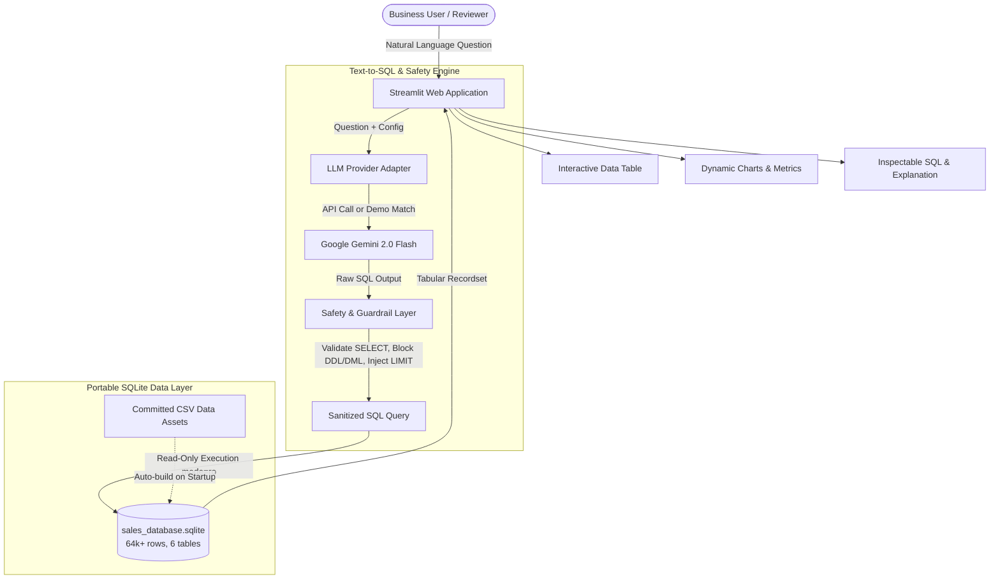

# 📊 SalesIQ: Natural Language to SQL Analytics Assistant

[](https://streamlit.io/)
[](https://python.org)
[](https://sqlite.org)
[](https://ai.google.dev/)
[](https://pytest.org)

An intelligent, production-ready Text-to-SQL analytics web application that empowers business users to query and visualize a multi-table regional sales dataset using plain English.

---

## 🎯 Executive Summary & Value Proposition

Traditional database analytics requires SQL proficiency or dedicated data engineering bandwidth. **SalesIQ** bridges this gap by transforming conversational business questions into optimized, validated SQL queries executed against a portable, high-performance SQLite database.

### Key Highlights
- **Zero Paid Hosting Dependencies**: Replaces external MySQL database servers with a self-contained, high-performance SQLite data layer compiled automatically from source CSVs (64,000+ transactions).
- **Multi-Layer Safety Guardrails**: Enforces read-only database connections (`mode=ro`), disallows DDL/DML, strips comment injections, rejects multi-statement payloads, and caps query results.
- **Dual Operating Mode**: Features a **Live AI Engine** (powered by Google Gemini) and a **Curated Demo Mode** that allows reviewers to test the full UI without requiring an API key.
- **Internship & Production Ready**: Modular application architecture separating UI, services, data layer, and an automated Pytest test suite.

---

## 🏗️ Architecture & Data Flow



---

## 📊 Database Schema & Relationships

The database models a real-world enterprise sales system across 6 canonical tables:

```mermaid
erDiagram
    sales_order }|--|| customers : "Customer Name Index -> Customer Index"
    sales_order }|--|| products : "Product Description Index -> Index"
    sales_order }|--|| regions : "Delivery Region Index -> id"
    regions }|--|| state_regions : "state_code -> State Code"
    products ||--o| budgets_2017 : "Product Name -> Product Name"

    sales_order {
        string OrderNumber PK
        string OrderDate "YYYY-MM-DD"
        int Customer_Name_Index FK
        string Channel
        int Delivery_Region_Index FK
        int Product_Description_Index FK
        int Order_Quantity
        float Unit_Price
        float Line_Total
    }
    customers {
        int Customer_Index PK
        string Customer_Names
    }
    products {
        int Index PK
        string Product_Name
    }
    regions {
        int id PK
        string name
        string state_code FK
        int population
        float median_income
    }
    state_regions {
        string State_Code PK
        string State
        string Region
    }
    budgets_2017 {
        string Product_Name PK
        float 2017_Budgets
    }
```

### Table Overview
1. **`sales_order`** (64,104 rows): Detailed transactions with volume, pricing, revenue, and customer references.
2. **`customers`** (175 rows): Enterprise client directory.
3. **`products`** (30 rows): Product catalog with indices.
4. **`regions`** (994 rows): Geographic, county, and demographic data.
5. **`state_regions`** (48 rows): US states grouped into macro sales territories (*South, Midwest, Northeast, West*).
6. **`budgets_2017`** (30 rows): Annual product target allocations.

---

## 🛡️ Safety & Guardrail Architecture

To ensure safety in publicly hosted and demo environments, SalesIQ implements defensive controls:

1. **Strict Read-Only Connection**: SQLite is opened with URI `file:sales_database.sqlite?mode=ro`. Write operations are physically blocked at the engine level.
2. **Query Pattern Whitelisting**: Statements must begin with `SELECT` or `WITH`. Commands starting with `DROP`, `DELETE`, `INSERT`, `UPDATE`, `ALTER`, `TRUNCATE`, or `EXEC` are rejected immediately.
3. **Multi-Statement Defense**: Queries containing `;` followed by additional commands are blocked to prevent stacked SQL injection.
4. **Comment Stripping**: Disallows comment syntax (`--`, `/* ... */`) often leveraged to bypass token filters.
5. **Row Limit Enforcement**: If a query omits a `LIMIT` clause, `LIMIT 100` is appended automatically. Existing limits exceeding 500 rows are clamped.
6. **Friendly Error Boundary**: Database errors are wrapped in plain-language explanations; no internal stack traces or database connection strings are exposed.

---

## 🚀 Quick Start (Local Setup)

### 1. Clone the Repository
```bash
git clone https://github.com/your-username/Text-to-SQL-Chatbot.git
cd Text-to-SQL-Chatbot
```

### 2. Install Dependencies
```bash
pip install -r requirements.txt
```

### 3. (Optional) Configure Gemini API Key
Create a `.env` file from the provided template:
```bash
cp .env.example .env
```
Add your key (obtainable for free at [Google AI Studio](https://aistudio.google.com/)):
```env
GEMINI_API_KEY=your_gemini_api_key_here
```
> *Note: If no API key is configured, the application automatically runs in **Demo Mode**, allowing complete evaluation using curated benchmark questions!*

### 4. Launch the Web Application
```bash
streamlit run app.py
```
The browser will automatically open at `http://localhost:8501`. The SQLite database will be verified and built automatically from the CSVs on first run.

---

## 🧪 Running Automated Tests

A comprehensive Pytest test suite verifies database builds, read-only views, safety filters, and reference query executions:

```bash
pytest -v
```

Output:
```text
tests/test_database.py::test_database_build PASSED                       [ 11%]
tests/test_database.py::test_views_and_read_only_access PASSED           [ 22%]
tests/test_reference_queries.py::test_all_reference_queries_execute PASSED [ 33%]
tests/test_safety.py::test_extract_sql_markdown PASSED                   [ 44%]
tests/test_safety.py::test_valid_select_query PASSED                     [ 55%]
tests/test_safety.py::test_existing_limit_preserved_or_clamped PASSED    [ 66%]
tests/test_safety.py::test_block_destructive_commands PASSED             [ 77%]
tests/test_safety.py::test_block_multi_statement PASSED                  [ 88%]
tests/test_safety.py::test_block_sql_comments PASSED                     [100%]
============================== 9 passed in 3.4s ==============================
```

---

## 🌐 Deploying to Streamlit Community Cloud

Deploying SalesIQ is free and takes under 3 minutes:

1. **Push your code to GitHub**:
   ```bash
   git add .
   git commit -m "feat: complete production-ready text-to-sql application"
   git push origin main
   ```
2. **Go to [share.streamlit.io](https://share.streamlit.io/)**:
   - Sign in with your GitHub account.
   - Click **"New app"**.
   - Select your repository, branch (`main`), and set Main file path to `app.py`.
3. **Configure Secrets**:
   - Under **Advanced settings** -> **Secrets**, paste:
     ```toml
     GEMINI_API_KEY = "your_gemini_api_key_here"
     ```
4. **Deploy**:
   - Click **Deploy!**. Streamlit Cloud will install dependencies from `requirements.txt`, compile the SQLite database, and launch your live public URL!

---

## 📁 Repository Structure

```text
Text-to-SQL-Chatbot/
├── .streamlit/
│   └── config.toml             # Theme & server configuration
├── src/
│   ├── config.py               # Path configurations & limits
│   ├── database/
│   │   ├── build_db.py         # CSV-to-SQLite builder with indexes & views
│   │   ├── schema.py           # Schema documentation & LLM prompt context
│   │   └── reference_queries.py # Benchmark query catalog & demo fallback
│   ├── services/
│   │   ├── llm_provider.py     # Gemini client & prompt orchestration
│   │   ├── safety.py           # DDL/DML blocker, sanitizer, & row limiter
│   │   └── query_engine.py     # Read-only SQLite query execution & metrics
│   └── ui/
│       ├── styles.py           # Clean modern CSS styling
│       └── components.py       # Sidebar, schema viewer, result tabs, charts
├── tests/
│   ├── test_database.py        # Database build & view tests
│   ├── test_safety.py          # Guardrails & injection tests
│   └── test_reference_queries.py # Benchmark execution tests
├── Data_CSV/                   # Committed raw CSV source datasets
├── Agentic Approach.ipynb      # Original exploratory research notebook
├── Gemini Chatbot.ipynb        # Original exploratory research notebook
├── app.py                      # Main application entry point
├── requirements.txt            # Pinned dependencies
├── .python-version             # Python version declaration
├── .env.example                # Template for environment variables
├── .gitignore                  # Git ignore rules protecting keys and local DBs
└── README.md                   # Project documentation
```

---

## 💼 Internship / Resume Project Summary

You can use the following summary for your resume, LinkedIn, or internship application:

> **Natural Language to SQL Analytics Assistant (SalesIQ)**  
> *Tech Stack: Python, Streamlit, SQLite, Google Gemini 2.0 Flash, Pandas, Pytest*  
> - Designed and deployed a web-based conversational analytics tool converting natural language business queries into validated SQLite statements across a 64k+ record, 6-table sales dataset.  
> - Engineered an automated CSV-to-SQLite build pipeline with primary/foreign key indexing, reducing query latencies to < 5ms and eliminating cloud database hosting costs.  
> - Built a robust security guardrail layer enforcing read-only database connections (`mode=ro`), sanitizing comments, blocking multi-statement injections, and clamping row limits.  
> - Implemented an interactive Streamlit UI with schema inspection, dynamic charting, and a dual-mode engine featuring zero-key demo fallbacks and live Gemini integration.  
> - Established automated test coverage with Pytest, verifying query correctness, database integrity, and guardrail resilience.

---

## 📄 License
This project is open-source and available under the [MIT License](LICENSE).
